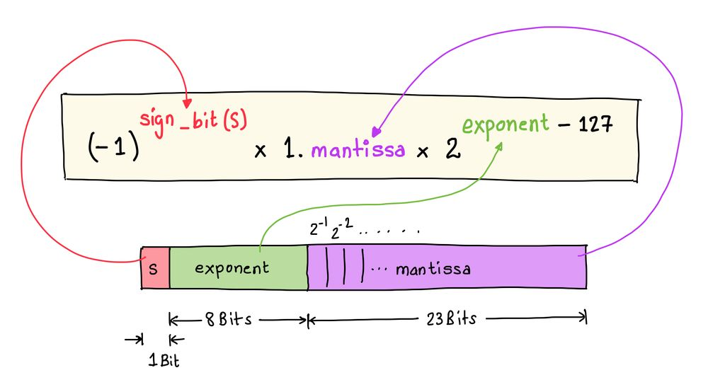
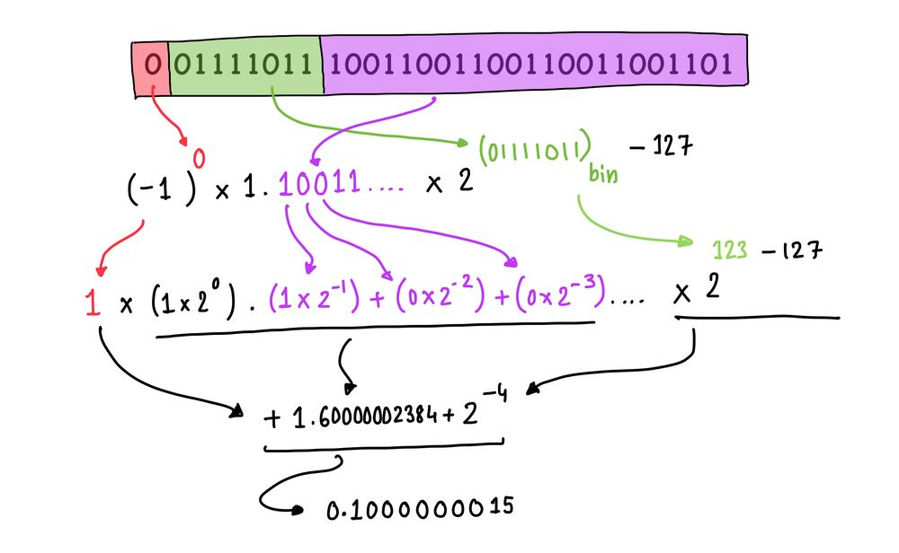

+++
title = '0.1 is not 0.1. Yups!'
date = "2023-04-28"

author = "Piyush Itankar"
authorImage ="teams/piyush.jpg"
preferred = "https://x.com/dstreetdogg"
linkedin = "https://www.linkedin.com/in/streetdogg/"
twitter = "https://x.com/dstreetdogg"
blog = "itankar.com"
email = "piyush@inpyjama.com"

tags = [
    "const"
]
categories = [
    "system", "c language"
]

series = ["c"]
images = ["/post/0.1-isnot-0.1/1.webp"]
+++

Computers can't store `0.1` accurately. It is stored as `0.1000000015`! In this post we explore and take a look at what is really going on.
<!--more-->


Don't trust me? Don't have to. Compile and run the following C code. Assuming the code above is saved in `main.c`, you can compile and run the compiled code as shown below -

```c { title = "main.c", verbatim=false }
#include <stdio.h>

void main() {
  float value = 0.1;

  printf("value: %0.10f\n", value);
}
```
```bash { title = "output on the terminal", verbatim=false }
~/
❯ gcc main.c

~/
❯ ./a.out
0.1000000015
```

Computers don't store 0.1 as 0.1? That is correct!

## How is 0.1 represented?

Try another experiment. Compile and run the following -

```c { title = "main.c", verbatim=false }
#include <stdio.h>

void main() {
  float value = 0.1;

  printf("value: %0.10f\n", value);
  printf("In Hex: 0x%x\n", *(unsigned int *)&value);
}
```
```bash { title = "output on the terminal", verbatim=false }
~/
❯ gcc main.c
❯ ./a.out
value: 0.1000000015
In Hex: 0x3dcccccd
```


## Whats going on?

> Say hello to - IEEE 754 floating-point format :)

A floating-point number is typically represented using the **`IEEE 754`** standard for **single-precision floating-point** format. This format uses 32 bits (or 4 bytes) of memory to represent a floating-point number.

The single-precision floating-point format consists of three parts: **`the sign bit, the exponent, and the mantissa (also known as the significand)`**.

The exponent is an `8-bit` field that represents the magnitude of the number. It is biased by `127`, which means that an exponent of `0` represents a very small number (close to zero), while an exponent of `255` represents a very large number (such as infinity).

The mantissa is a `23-bit` field that represents the significant digits of the number. It includes the fractional part of the number and is used to store the precision of the number.



> Notice that the fractional part is `xxx..` in `1.xxx...` and that, every number is reduced to `1.something` and the exponent is adjust accordingly.

## Back to `0x3dcccccd`

`32-bit` representation of the number `0.1` using the single-precision floating-point format: `0x3dcccccd(hex)` which in binary translates to -

# `0 01111011 10011001100110011001101`

Breaking this down, we can see that:



- The sign bit is `0`, which means that the first bit is `0`.
- The exponent is `01111011`, which represents `123` in decimal. Adding the bias of `127` gives us an exponent of `-4`.
- The mantissa is `10011001100110011001101`. To convert this to decimal, we can interpret it as a binary fraction by placing a binary point at the left end and multiplying each bit by the corresponding power of two:

```bash
0 01111011 10011001100110011001101
= 1.10011001100110011001101(binary) x 2^-4
= 1.60000002384(decimal) x 2^-4
= 0.1000000015(decimal)
```

## Try

There are many more decimal numbers that cannot be represented accurately. Can you guess some?
