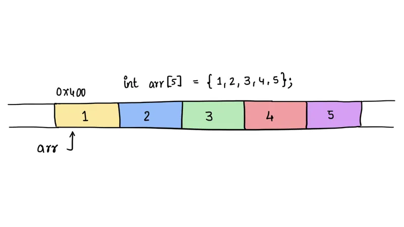
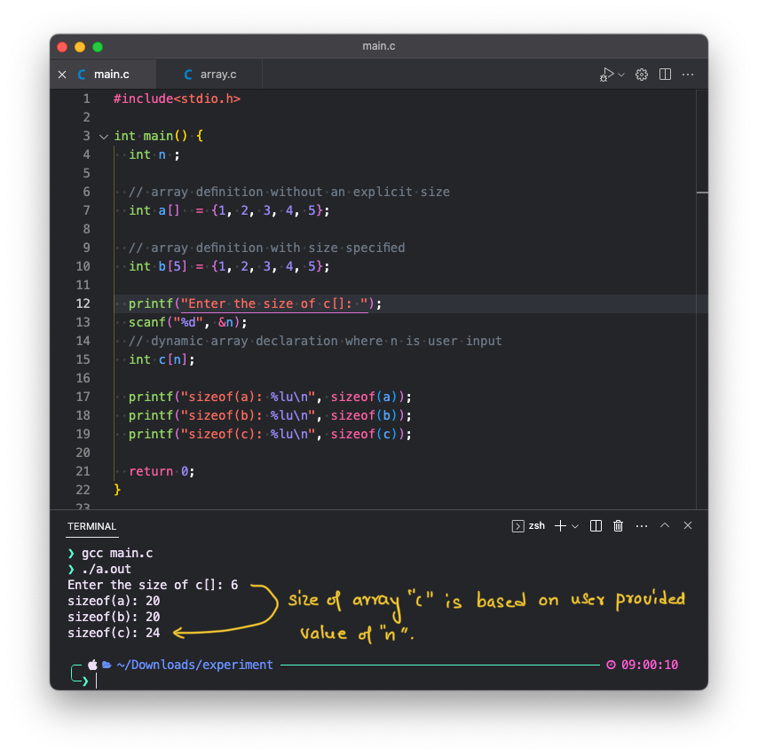
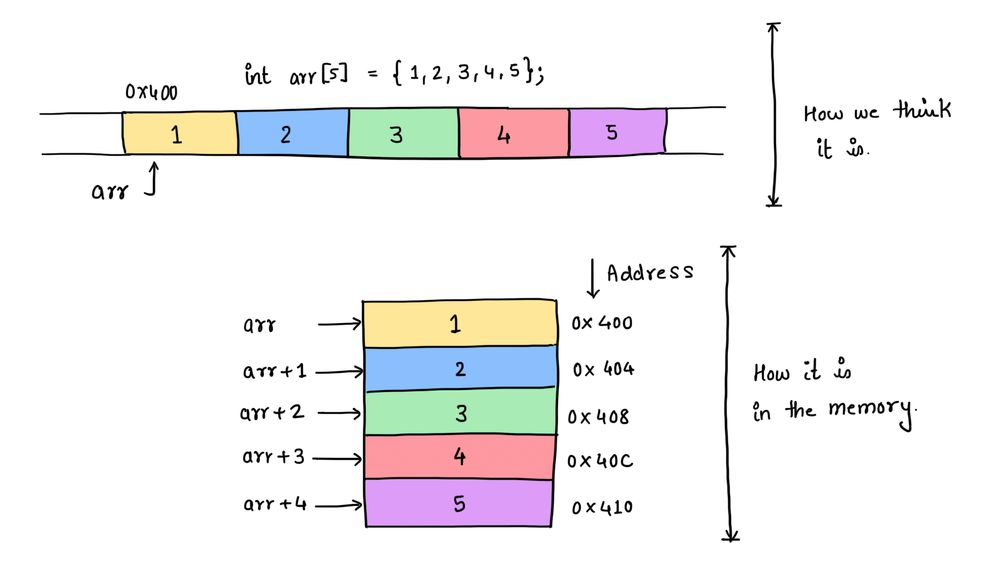
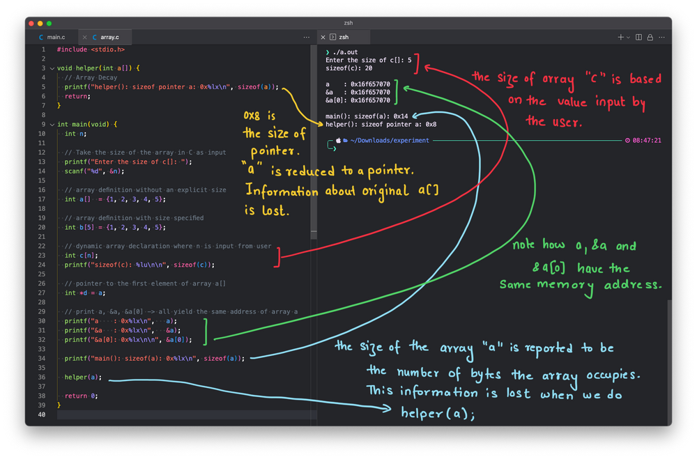
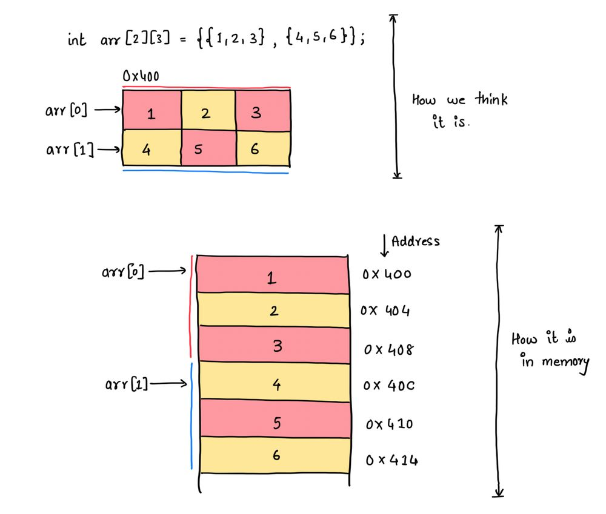

+++
date  = "2024-08-11"
title = 'C Arrays, behind the scene !!'

author = "Dev Bishnoi"
authorImage ="teams/dev.jpg"

tags = [
    "caches", "cpu"
]
categories = [
    "system", "c language"
]

series = ["c"]
images = ["/post/c-arrays/hero.webp"]

linkedin = "https://www.linkedin.com/in/dev-bishnoi-468596126/"
twitter = ""
blog = ""
email = "dev@inpyjama.com"
+++

An Array in C is a collection of similar types of data elements. It is a built-in data type and is widely used by developers. Here, we will cover the array declarations, the memory layout, array decay, and multi-dimensional arrays.

<!--more-->



## Array Declaration

The array is declared with the following syntax -

```c
dataType arrayName [array_size];
```

An array can be defined by specifying the initial value of the array elements, the compiler can identify the array size if not specified explicitly.



> C99 and beyond support dynamic array declaration. The size of the array depends on the user-provided input.

### Memory Layout

A contiguous memory space is allocated for array elements and can be accessed via an array index.



> The array size is a compile-time constant!

The `i`th element of an array can be accessed in a constant time via `arr[i]`. It is located at the address `arr + i * sizeof(int)`. Here, the `arr` is the address of the first element in the array, in the above case `0x400`.

`arr`, `&arr`, and `&arr[0]` all yield the same value (the address of the first element of the array and it is the same as the address of the array itself). Hence, `arr[i]` is effectively translated to `*(arr + i)` i.e. dereferencing element at the address `(a+i)`.

According to the pointer arithmetic `arr + i` will be calculated to `arr + i * sizeof(int)`.



> Note: `arr[i] = *(arr + i) = *(i + arr) = i[arr]`

One can calculate the array size using sizeof() function. Where does array size come from? Is it stored anywhere?

Answer - **No!**

The arr is an object of type `int[5]`, which is well known to the compiler at compile time. When you ask the compiler `sizeof(arr)` it returns `5 * sizeof(int) = 5 * 4 = 20`. So the array size can be calculated with `sizeof(arr) / sizeof(int)`.

### Array and Pointers

Array and pointers are generally used interchangeably. An array passed to a function is normally captured as a pointer to the data type. When an array is passed, the address of the first element is passed and captured in a pointer.

### Array Decay
A loss of type and dimension of an array is known as **Array Decay**. The C standard dictates that arrays passed as parameters decay to a pointer to the first element. Hence, The argument `int a[]` in the helper function on line 3 is the same as `int *b`. So the `sizeof` operator in line 5 will return the size of an integer pointer, which on my machine is `0x8`. The programmer needs to pass the array size explicitly to access the array correctly.

### Multidimensional Array
An N-dimensional array is an array of arrays. It will be mapped to one-dimensional memory addresses.

```c
dataType arrayName [size1][size2][size3]...[sizeN];
```

For example - A 2D array defined as follows can be viewed as a table of two rows and three columns.

```c
int arr[2][3] = {{1, 2, 3}, {4, 5, 6}};
```



The `arr[i][j]` will be placed at `(arr + i * size of row + j * size of an array element)`.

#### Now you try -

```c
int arr[2][3] = {{1, 2, 3}, {4, 5 ,6}};
int **pv = arr;
printf("0x%lx, 0x%lx, 0x%lx\n", arr, arr + 1, *(arr + 1));
printf("0x%lx, 0x%lx, %d\n", pv, pv + 1, *(pv + 1));
```

Assume `0x400` to be the starting address of the given 2d array. What do you think the print statements will output?

### Further reading
- https://www.opensourceforu.com/2016/09/decayintopointers/?ref=ghost-blog.inpyjama.com
- https://riptutorial.com/c/example/13402/misunderstanding-array-decay?ref=ghost-blog.inpyjama.com
- https://clang.llvm.org/extra/clang-tidy/checks/cppcoreguidelines/pro-bounds-array-to-pointer-decay.html?ref=ghost-blog.inpyjama.com
- https://learn.microsoft.com/en-us/cpp/code-quality/c26485?view=msvc-170&ref=ghost-blog.inpyjama.com
- https://c-faq.com/aryptr/aryvsadr.html?ref=ghost-blog.inpyjama.com
