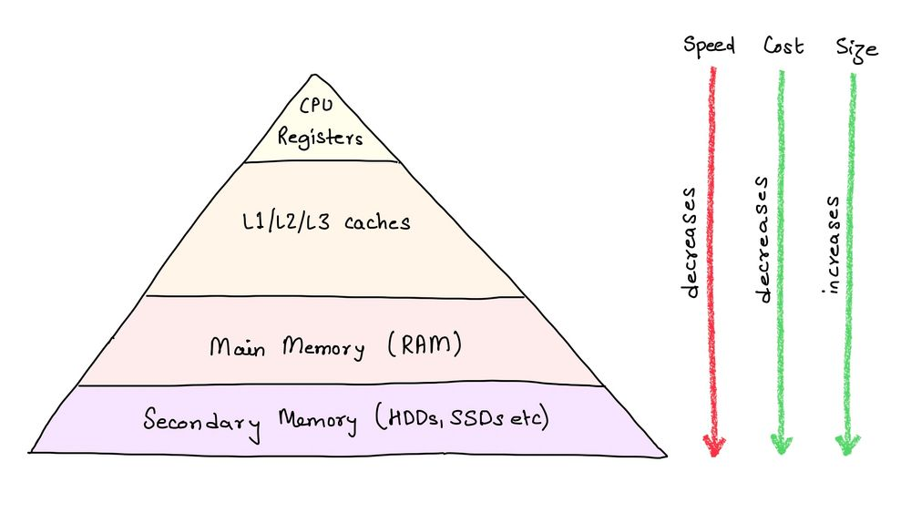
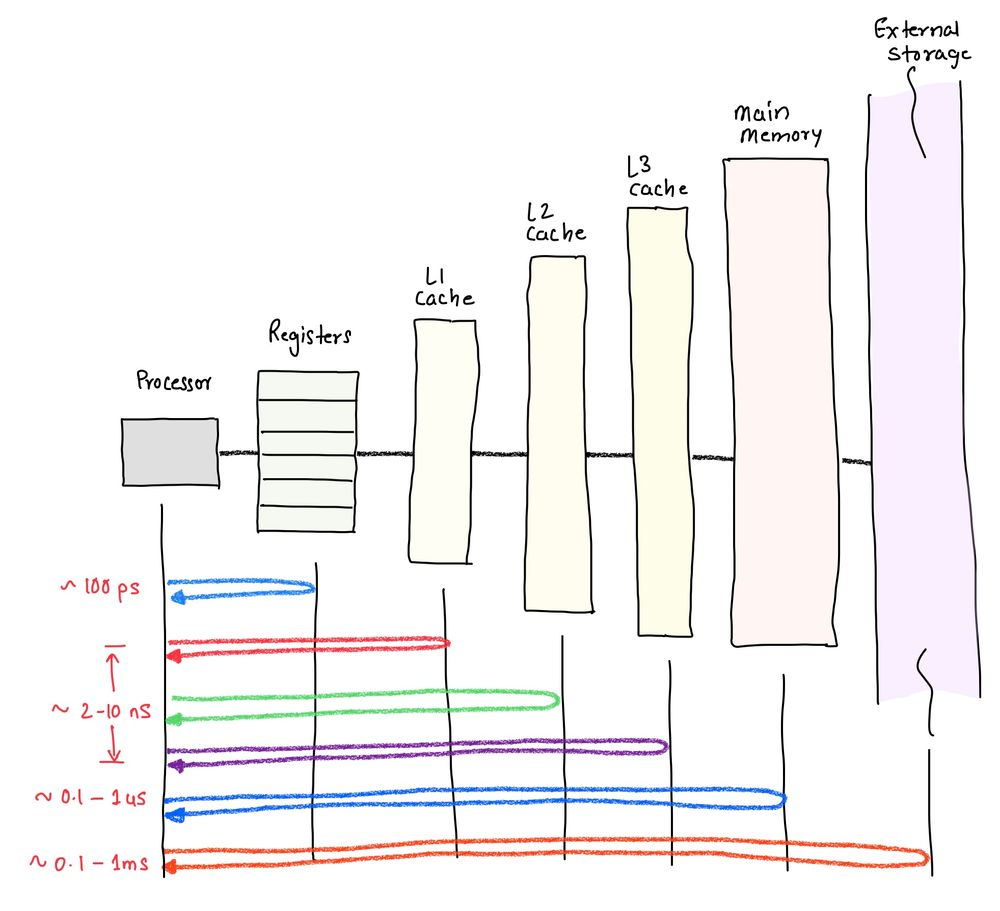
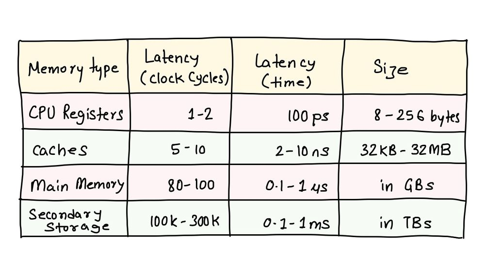

+++
title = 'CPUs, Pantries, and Caches'
date = "2023-04-30"

author = "Mahmad Bharmal"
authorImage ="teams/mahmad.jpeg"
preferred = "https://www.linkedin.com/in/mahmadbharmal/"
linkedin = "https://www.linkedin.com/in/mahmadbharmal/"
twitter = ""
blog = ""
email = "mahmad@inpyjama.com"

tags = [
    "caches",
]
categories = [
    "cpu", "computer architecture"
]

series = ["Computer Architecture"]
images = ["/post/cpu-pantries-caches/1.jpg"]
+++

What is common between Chefs and CPUs in terms of how they strive for efficiency? 🥸
<!--more-->

Imagine you're a chef working in a busy restaurant. You have to prepare dishes quickly and efficiently to keep up with the orders coming in. However, the pantry where you store your ingredients is located far away from the kitchen, and it takes a long time to retrieve the ingredients you need. This slows down your cooking and makes it difficult to keep up with the demand.

To solve this problem, you decide to set up a small pantry right next to your cooking station. You fill it with the most commonly used ingredients, such as oil, salt, and chilli (if you like your spices 😝). Now, when you need an ingredient, you can quickly grab it from the nearby pantry instead of making the long trek to the main pantry. This saves you time and allows you to prepare dishes faster and more efficiently.

A very similar strategy is applied to the computer systems as well. In order to understand it better we need to go through the memory hierarchy.

## Memory Hierarchy

Memory hierarchy is a system of different memory types, each with its own characteristics, that work together to store and access data in a computer system. The memory hierarchy typically includes several levels of memory, each with different capacities, access speeds, and costs.

### CPU Registers

At the top of the memory hierarchy is the CPU's registers, which are small but extremely fast memory locations inside the CPU. Registers are used to hold data that the CPU is currently working with, such as variables and program counters. Accessing registers is very fast, but they are limited in number and capacity, and their contents are lost when the CPU is powered off.

### Caches

The next level in the memory hierarchy is the cache, which we've already talked about. Caches are small, fast memory banks that store frequently accessed data from the main memory. They are designed to minimize the time it takes for the CPU to access frequently used data, and to reduce the number of trips the CPU has to make to the main memory.

### Main Memory (RAM)

Below the cache is the main memory, also known as RAM (Random Access Memory). This is the memory that most people are familiar with, and it's where the majority of data and programs are stored when they are in use. Main memory is much larger than cache, but it's slower to access.

### Secondary Memory

Finally, at the bottom of the memory hierarchy is secondary storage, which includes devices such as hard disk drives (HDDs) and solid-state drives (SSDs). These devices are slower than main memory, but they have much larger capacities and can store data even when the computer is powered off. Secondary storage is typically used to store the operating system, programs, and files that are not currently in use.

## Finer Details

The memory hierarchy is a system of different memory types, each with its own speed, capacity, and cost characteristics. The CPU's registers are at the top of the hierarchy, followed by caches, main memory, and finally, secondary storage. Each level of the hierarchy is designed to provide a balance of speed, capacity, and cost, to ensure that the system runs as efficiently as possible. The following table may help quantify these characteristics.

## Why can't all memory be CPU registers?

1. It seems evident that the fastest of memories are CPU registers and caches. It is natural to be greedy and ask why can't every memory be made like registers or caches to have the highest access speeds?
1. Physics prevents us from doing that! We'll peel this Onion in later posts :)

## Caches are CPU's local Pantry!

Now that we are aware of memory hierarchy, the next obvious question is how can this be used to our advantage? The key is that much like the Chef, the CPU will keep the frequently used data close by - in the cache!

What to keep in the cache is based on two seemingly obvious but important properties of a typical program/software -
1. Temporal Locality
1. Spatial Locality

The details of how this happens, we will explore in future posts.
