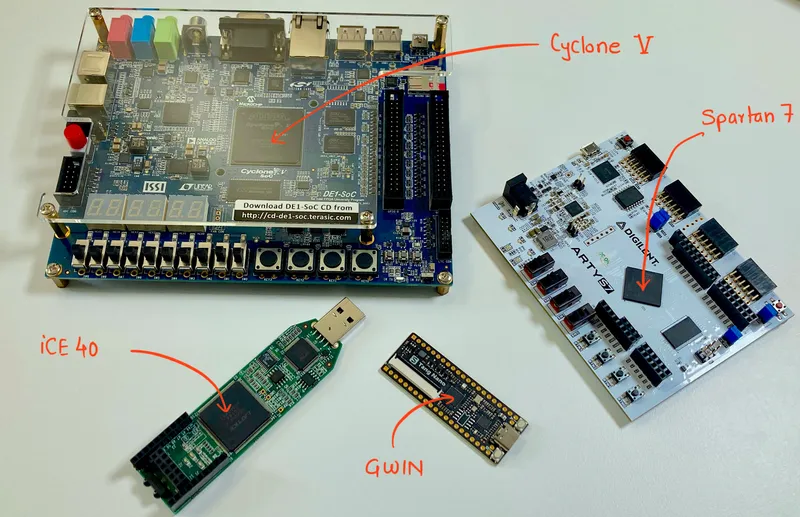
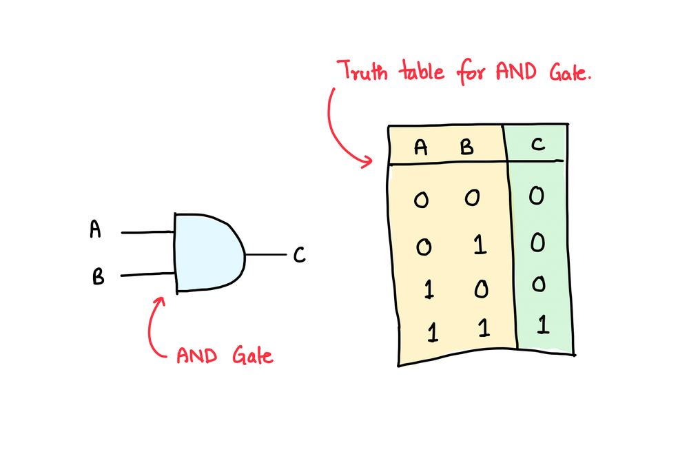
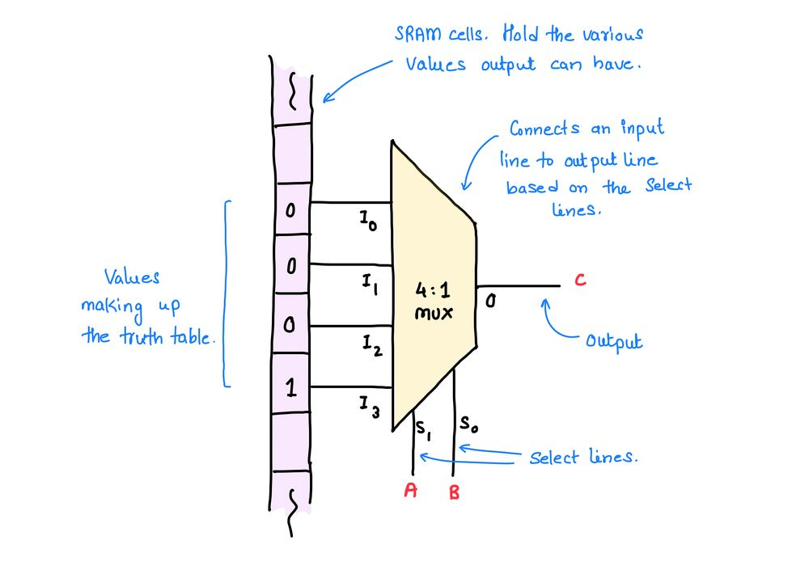
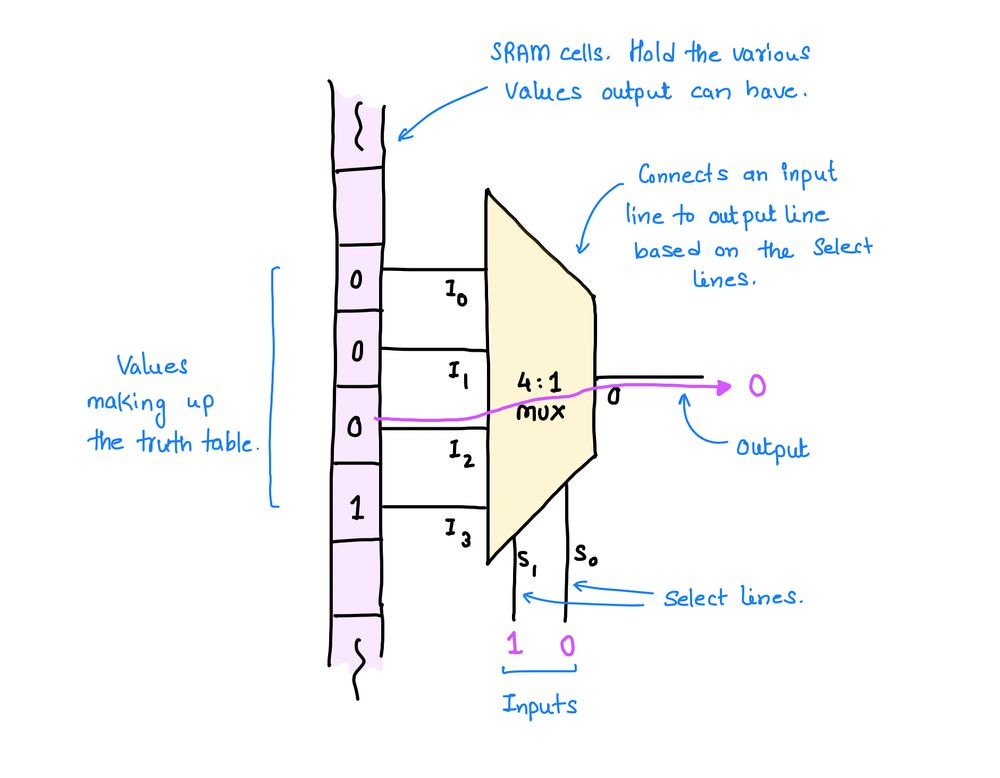
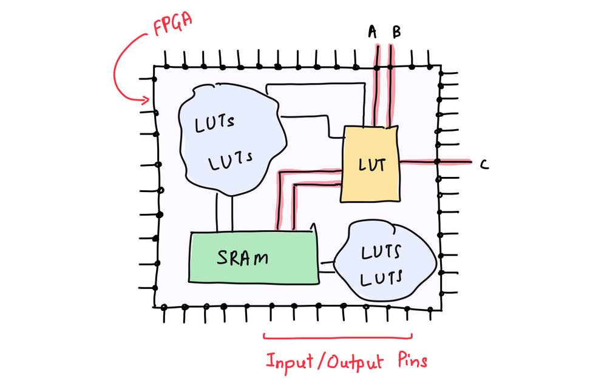

+++
title = 'FPGAs for the rest of us'
date = "2023-04-22"

author = "Piyush Itankar"
authorImage ="teams/piyush.jpg"
preferred = "https://x.com/dstreetdogg"
linkedin = "https://www.linkedin.com/in/streetdogg/"
twitter = "https://x.com/dstreetdogg"
blog = "itankar.com"
email = "piyush@inpyjama.com"

tags = [
    "fpga",
]
categories = [
    "fpga",
]

series = ["fpga"]
images = ["/post/fpga-for-the-rest-of-us/1.webp"]
+++

FPGAs can be programmed to become digital circuit of choice. The code becomes the hardware! We explore the mechanics behind how the FPGA might be able to implement circuits.

<!--more-->

FPGA stands for Field Programmable Gate Arrays. You can think of it as something programmable like a CPU, except that the code becomes the hardware! The code for an FPGA is essentially a digital circuit described somehow (we'll look at this in later posts) in a text file. Once compiled and flashed, the internal blocks of the FPGA rewire themselves to become the stated logic!

In this post, we will build a mental model of how the FPGA might be implementing the programmed logic.

---

Let's talk about a simple two-input AND gate. It takes two inputs, say A and B, and has an output C. We will refer to positive logic to avoid confusion. What that means is that 1 represents digital HIGH, and 0 represents digital LOW.

## The AND Gate

`Output is 1 only if both its inputs are 1!`

That's the definition of AND gate. Now, think about how it may be implemented?

> **AND** Gate and its truth table. Note that the truth table completely describes the Gate.

Well, one way is to go down to the semiconductor physics level and arrange transistors to make an AND gate. The problem with this is that you need a lot of industrial equipment/process, special technologies, experienced labor, time, etc. That is too much work to implement a single AND gate!

If you were to design a digital circuit full of transistors, build it by putting transistors in place, one transistor at a time; good luck to you! Watch [Sam Zeloof make a chip at home in the video](https://www.youtube.com/watch?v=XrEC2LGGXn0&t=135s). It should convince you of the complexity involved.

> As a side note, this is exactly what established semiconductor companies like Intel, AMD, Apple, etc. do to make their chips/silicon; they work with fabrication facilities like TSMC, to get the chips printed.

Back to the FPGA. So, the FPGA gives us a way to make a circuit in silicon (almost!) by rewiring pre-existing circuits within it (very different from picking and connecting transistors and logic gates). Remember, AND gate's working is represented by its truth table. If we can cook up

`a circuit that can look at the inputs, read the truth table and tell us what the output has to be,`
we would have found a way to implement the AND gate.

Of Course, this comes at a cost - generic circuits (think lego like something) is power hungry and bulky (meaning that it takes more number of transistors to implement it). This is no problem for prototyping and experimenting!

Since these circuits read a table, they can be used to implement almost any digital circuit. After all, the individual circuit is just looking at the inputs, then looking up the answer in a table and telling the output. The output of one such circuit can be connected to another and so on.  Making complex digital logic would be possible.

As you can imagine, implementing a digital circuit is thus, putting it's truth table in the chip and routing the connections between the generic circuits. Easy and powerful, eh?

> Some manufacturer could give us a chip with a sea of such circuits. They could could in fact make lot of copies of that generic circuit and provide a way to wire the inputs and outputs within a single chip. This is what companies like - Xilinx, Lattice and Intel do for their line of FPGA offerings. 🙂

This in fact is the central idea of FPGAs. The generic circuit that does the job of reading the table to see what the output has to be for the given inputs is called a Lookup Table (LUT). Yes! The name is very obvious and so is the functionality.

This is the key component/circuit of an FPGA and everything else that lives inside it is just the supporting infrastructure. Let us now predict the design of the LUT. The most basic possible one.

## The Lookup Table (LUT)

Look at the sketch below and things should start to make sense already if you are trying to guess how a LUT might look. What should be obvious is the "Lookup" part is done using a Multiplexer.

> Recall that the multiplexer has many inputs, select lines and a single output.

A Lookup table can be thought of as a Mux connected to memory cells (and outputs of other LUTs, not shown here...) with the control signals being the inputs and the output of mux outputting the value of memory cell.

Based on the status of the select lines (S0-S1) the multiplexer chooses one of the inputs (I0-I3) and connects it to the output (O). So, in the sketch below A = 1 and B = 0 (these are the select lines), it reads the memory cell connected to the mux input I2 which happens to be 0 and connects that to the output/C. C is thus, 0 (the path is highlighted in Purple).

> A memory cell value is propagated to the output of the mux based on the select line values.

That's all there is to it! The entire hocus-pocus around FPGAs is just the fact that it implements a LUT (many of them actually) which is the generic circuit and can be used to implement a part of complex digital circuit. The inputs for this particular LUT comes from external pins, from other LUTs and/or the memory. The output also goes to an external pin (as in the figure below), the memory or other LUTs as in the image below (we will save the mechanics of this for a later discussion :)).

The memory (in this case the SRAM) cells hold the value corresponding to the various output that circuit can have. The two input AND gate can have four different values (all the values in the truth table).

Again, the LUT is looking for the value to be output from the memory! Thus, the four possibilities are -
- if `A = 0`, `B = 0` then `C = I0 (0)`.
- if `A = 0`, `B = 1` then `C = I1 (0)`.
- if `A = 1`, `B = 0` then `C = I2 (0)`.
- if `A = 1`, `B = 1` then `C = I3 (1)`.

In effect, the circuits in figures above behave like an AND gate!

## for later ...

Where do the 0s and 1s in the memory cells come from? Well, that's the content of the .bin file we flash on the FPGA. The .bin file is a stream of 0s and 1s that just go and sit in the memory. The FPGA interprets these values and automagically realizes the circuit, part of which involves our hero - "The LUT"!

I have to leave you here. I am assuming that the picture of LUT above delights you and gives you intellectual pleasure. While you enjoy that, remember that this is the simplest model. There are a lot of other questions that we need to address. For instance -

- where do the physical inputs come from?
- Where does the output go?
- What happens if the circuit is more complex?
- What about sequential circuits?
- The signal timings?
- How is the `.bin` generated and flashed?

And many more. We shall start to peel the onion in later notes. Until then, cherish the intellectual pleasure :) and do let us know if something was not clear (add a comment below).

## Reference

- [Three Ages of FPGAs: A Retrospective on the First Thirty Years of FPGA Technology](https://ieeexplore.ieee.org/document/7086413)
