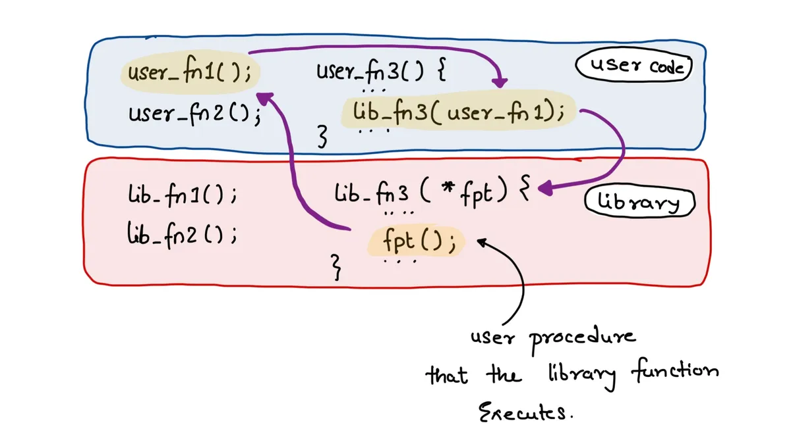
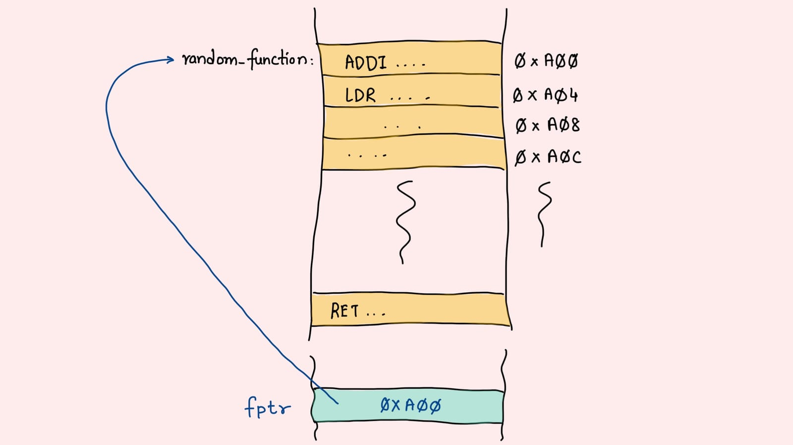
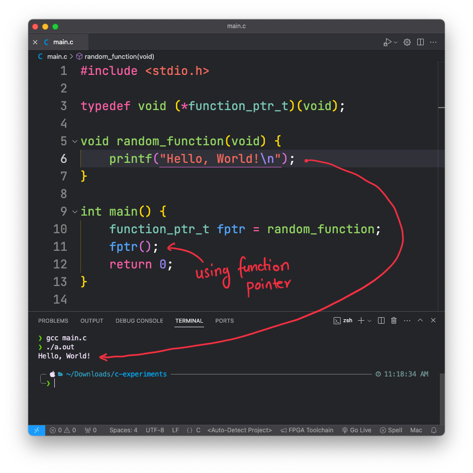
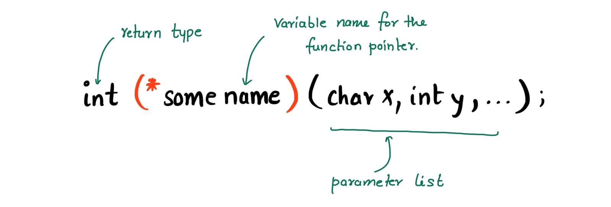
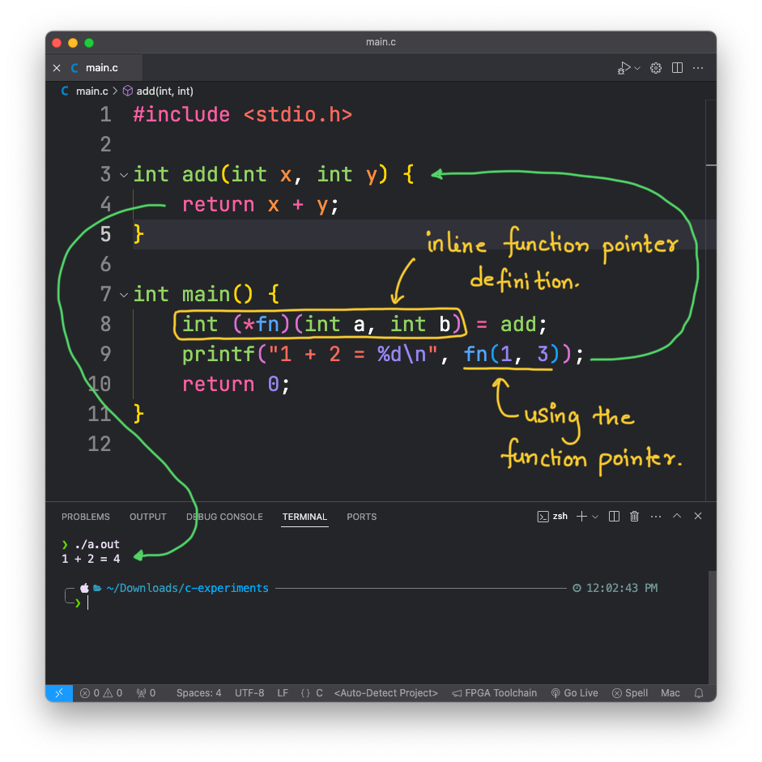
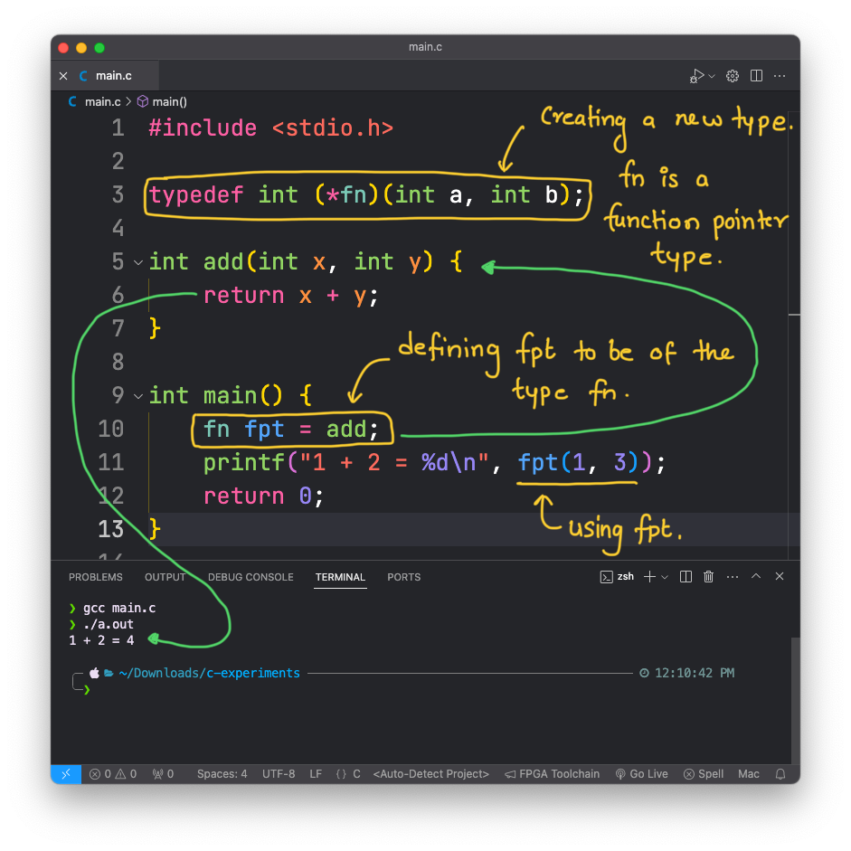
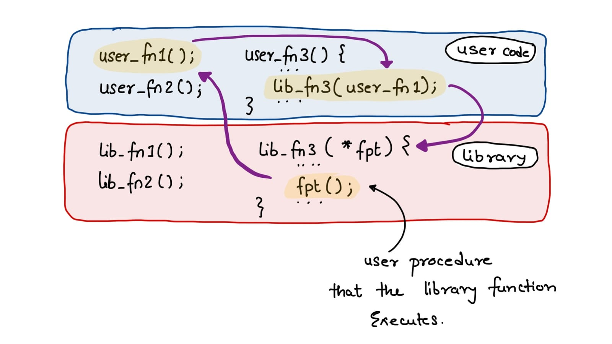

+++
date  = "2024-04-09T14:42:48+05:30"
title = 'Function Pointers - Everything you need to know!'

author = "Piyush Itankar"
authorImage ="teams/piyush.jpg"
preferred = "https://x.com/dstreetdogg"
linkedin = "https://www.linkedin.com/in/streetdogg/"
twitter = "https://x.com/dstreetdogg"
blog = "itankar.com"
email = "piyush@inpyjama.com"

tags = [
    "c", "pointers", "function pointers"
]

categories = [
    "C Language",
]

series = ["C Language"]
images = ["/post/function-pointer/1.webp"]
+++

In this post, we explore what a function pointer is, what it really means for the machine, how to define it, and how to use it.
<!--more-->



Function pointers are pointers that point to code. When these are dereferenced, the fetched data is treated like instructions and the CPU executes them.

> When we dereference a function pointer, the PC register in the CPU is set to the address held by the pointer.

Consider `typedef void (*function_ptr_t)(void);` to be the function pointer type. Because of the `typedef` keyword, the `function_ptr_t` is treated like a new type. As per this definition, the pointer is to return nothing and takes no parameters. Try the following code -

```c { title = "main.c - function pointer created as a global variable", verbatim=false }
#include <stdio.h>

typedef void (*function_ptr_t)(void);

void random_function(void) {
    printf("Hello, World!\n");
}

int main() {
    function_ptr_t fptr = random_function;
    fptr();
    return 0;
}
```

The output should be - `Hello, World!`. What happened here was, the `fptr` variable was of the type `function_ptr_t` which is a function pointer type. The `fptr` was pointing to the address where the code of `random_function` was saved. When we dereference the pointer with the syntax - `fptr()` the address is loaded into the program counter and the CPU fetches the instructions to execute.



Hopefully, you are convinced how a function pointer works. Now let's look at some more details and use cases.



# The Syntax

The general syntax is `return type (* function pointer name)(parameter list)`. The function/code being pointed to should have the same return type and parameters. For example, the snippets below add has the same return types and parameter list as fn.



## Without `typedef`

Using `typedef` is not strictly required, if we decide not to use it, the function pointer variable declaration will be as in the code below. Notice how the syntax is long and hard to read.

```c { title = "main.c - function pointer defined within a function", verbatim=false }
#include <stdio.h>

int add(int x, int y) {
    return x + y;
}

int main() {
    int (*fn)(int a, int b) = add;
    printf("1 + 2 = %d\n", fn(1, 3));
    return 0;
}
```



## With `typedef`

`typedef` will create a new type for us which happens to be called fn. We can use fn just like any other data type, as used to define `fpt`. This as you see, is more readable.

```c { title = "main.c - function pointer defined as a new type **fn** using the **typedef** keyword.", verbatim=false }
#include <stdio.h>

typedef int (*fn)(int a, int b);

int add(int x, int y) {
    return x + y;
}

int main() {
    fn fpt = add;
    printf("1 + 2 = %d\n", fpt(1, 3));
    return 0;
}
```



# When to use function pointers?

> The answer is when the bottom abstraction layer depends on the one on top!

Let's recall how software abstraction works -

1. Abstract the repeated lines of code as functions/procedures.
1. Abstract the functions related to a set of related operations as a library.
1. The user calls the functions from the library to get things done.

If this looks right, the next question we should ask is - **what happens if a library function depends on a procedure to be supplied by the user?** In such a case, we have an option between not creating the library and letting the user write the full function (which is bad) or providing a way for the user to pass the function/procedure to be executed to the library function - this is where we use function pointers!



> When a function takes as a parameter a function pointer, the function pointer is called the Callback function.

## Example: Interrupt Handlers

Such design philosophy is used in Event Driven programs and message passing. In the world of embedded systems the best example is that of - Interrupt handlers in the device drivers.

1. The OS (say, Linnux) provides interrupt management library, which provides a way to register an interrupt handler.
1. The device driver writer (the user of the interrupt management library) will need to provide a way to handle a given interrupt that is related to the device.
1. The library provides a function like - `register_interrupt_handler(interrupt_no, interrupt_handler)` that the user can use to tell what function to call when the given interrupt happens.

Say, a device driver code does something like so - `register_interrupt_handler(49, irq_49_handler);`. Meaning that, if the interrupt handler library detected that interrupt `49` has occurred, it should call the function `irq_49_handler()`. This is also depicted in the image below -

` function is registered with the kernel to be called when the interrupt `49` is fired.")

Notice that, the interrupt management library, once any interrupt occurs, just reads the interrupt number and then calls the corresponding registered function pointer - the interrupt handler. After the handler execution is complete, it clears the interrupt. The key is -

> Function pointers are used by the library to call the user functions :)
