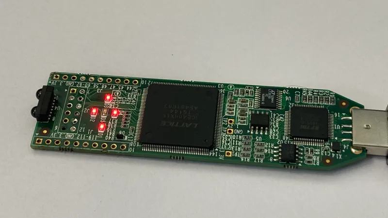
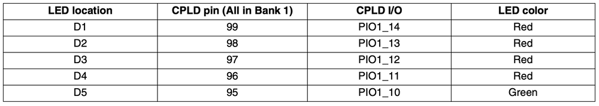
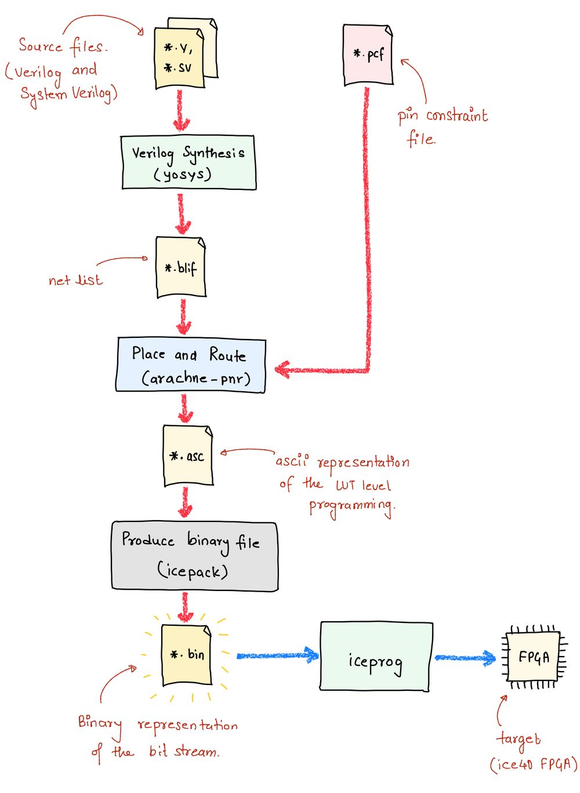
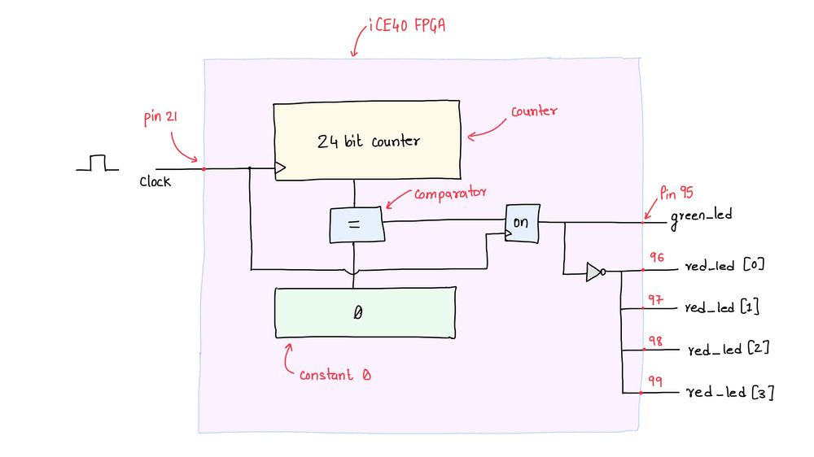
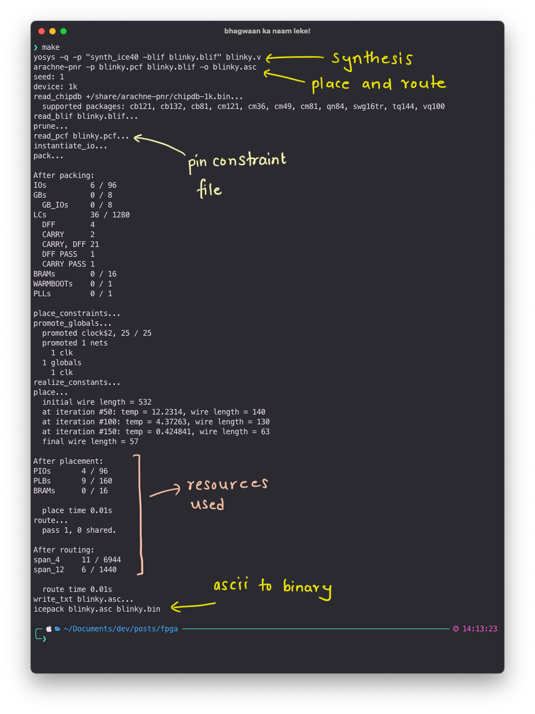

+++
title = 'Hardware Development Using FPGA'
date = "2023-05-13"

author = "Piyush Itankar"
authorImage ="teams/piyush.jpg"
preferred = "https://x.com/dstreetdogg"
linkedin = "https://www.linkedin.com/in/streetdogg/"
twitter = "https://x.com/dstreetdogg"
blog = "itankar.com"
email = "piyush@inpyjama.com"

tags = [
    "hardware",
]
categories = [
    "hardware",
]

series = ["fpga"]
images = ["/post/hardware-development-using-fpga/1.webp"]
+++

Hardware development flow using the open-source toolchain for synthesis, place-n-route, and programming of ice40 FPGA. We use Blinky as an example to guide the discussion.
<!--more-->



I assume you already know about FPGAs if you are reading this. For those who have no clue what it is, imagine it to be a hardware equivalent of `Lego blocks` that can be programmed.

FPGAs do not have processor-like machinery. They do not have any instruction set. Just a land of something called **"Look Up Tables"**, **"IO Blocks"** and **"Switching Box"**. FPGAs are programmed to become a Digital Circuit!

To guide the discussion we will use the `iCE40` FPGA from Lattice and the associated open-source toolchain (`project icestorm`) to program it.


Some clarification before we move on -

> Blinky circuit in the hardware world is equivalent to the *Hello, World!* in the software world!

Our goal is to blink the Green and Red LEDs (`D1` - `D5`) on the [Lattice iCEstick](http://www.mouser.in/new/Lattice-Semiconductor/lattice-icestick-kit/?ref=inpyjama.com) and in doing so, explore the hardware development flow.

## Introduction

FPGA-based hardware development is very straightforward -
- You describe the hardware you want to make in something called **Hardware Description Language** (in our case we shall use `Verilog`. It is just another language used to describe hardware, search more about it if you don't already know...) in a normal text file (ending in an extension `.v`).
- Specify which physical pins of the FPGA are to be associated with the input/output ports used in the code in yet another text file with an extension `.pcf`, this is called the constraints file. The ping constraint file varies from FPGA to FPGA and the format of specifying the connection vary from toolchain to toolchain.
From the manual of the Lattice iCEstick board, we have the following pin mapping available to us -

From the manual of the [Lattice iCEstick](http://www.mouser.in/new/Lattice-Semiconductor/lattice-icestick-kit/?ref=inpyjama.com) board, we have the following pin mapping available to us -



## Development Flow

The Verilog-based description needs to be converted into a stream of `0s` and `1s` that the FPGA can use to reconfigure itself. Each FPGA provider has an associated toolchain. In our case, we use the open-source toolchain. This toolchain includes a Verilog to netlist converter, netlist to place and route, generation of the binary file, and utilities to load binary on the FPGA. As below -



- We feed .v file into the yosys which shall do verilog synthesis for us to produce .blif file. This file represents the described circuit in a format that can be consumed by the place and route tool.
- Then we feed .blif and .pcf files to arachne-pnr to produce a .asc file. Arachne-pnr is the place and route tool. It lays out the structure of how the various blocks within FPGA will be connected to realize the circuit. The .asc file is the ASCII output of the placement and routing plan. It holds information about which Logic Blocks connect to one another and which Switching Box is used.
- We then put the .asc file into icepack utility which produces the .bin file which we use to program the FPGA. The .bin has what I referred to earlier as the "bit-stream". As the name goes, it is just a sequence of bits. When we program an FPGA we send this sequence of bits to it, and the programmer on the board accepts the incoming bits and loads the SRAM (don't bother if you don't know what that means :)) of the FPGA.
- Finally, we connect the FPGA stick into the USB port. And feed the .bin file into iceprog utility which would program the FPGA.

## Demo

Let us now describe the blinky hardware to blink the LEDs on the board. We will use the input clock on the FPGA as a way to add delays between the On/Off of the LEDs. We essentially will build a counter that counts the clock cycles.

> The input clock on the FPGA is fed through the physical pin #21 on the FPGA chip. This information is fed in as part of the .pcf file later.

## Install dependencies
Folks in the open-source community have taken the time and effort to reverse-engineer the bit-stream format (more on this in a while) of the lattice iCE40 FPGA series (Read more about the entire project IceStorm here).

To install the toolchain you have to be on a Linux machine (You can also do this on Mac and on Linux subsystem on Windows). I am on macOS 13.3.1 as I write this article and I have also tried this on Ubuntu 22.04.2 LTS.

To install the dependencies, open a terminal and execute the following on the prompt. On a Linux system use the following -

```bash {title="Linux: dependencies to be installed."}
sudo apt install build-essential clang bison flex libreadline-dev \
                     gawk tcl-dev libffi-dev git mercurial graphviz \
                     xdot pkg-config python3 libftdi-dev
```

On macOS, use the following -

```bash {title="MacOS: dependencies to be installed."}
brew install bison flex gawk graphviz xdot pkg-config python3
```

This will install all the required utilities for the components of the toolchain to work.

## Install Toolchain

We would now want to get the toolchain! Use the following to build it from the source and install all the utilities on the local machine. These commands are the same for both - Linux and macOS.

### IceStrom tools

These utilities help us convert between file formats and program the FPGA.

```bash {title="Commands to download the source and install the **icestorm** tools" verbatim=false}
git clone https://github.com/cliffordwolf/icestorm.git icestorm
cd icestorm
make -j$(nproc)
sudo make install
```

### Place and Route Tool

`arachne-pnr` is the place and route tool. Given a netlist, this tool figures out how to map that to the resources on the FPGA.

```bash {title="Commands to download the source and install **arachne-pnr**" verbatim=false}
git clone https://github.com/cseed/arachne-pnr.git arachne-pnr
cd arachne-pnr
make -j$(nproc)
sudo make install
```

### Synthesis Tool

`yosys` is the open-source synthesis tool. It can process the hardware description language like Verilog and System Verilog and convert it to a netlist. The netlist is then consumed by the place and route tool.

```bash {title="Commands to download the source and install **yosys**" verbatim=false}
git clone https://github.com/cliffordwolf/yosys.git yosys
cd yosys
make -j$(nproc)
sudo make install
```

## The Blinky circuit
Create three files - `Makefile`, `blinky.v` and `blink.pcf`. These are normal text files and you can use any editor of your choice to edit these. Populate the files with the content below -

```verilog  {title="blinky.v" verbatim=false}
module led_glow(clock, green_led, red_led);
    input  clock;
    output green_led;
    output [3:0] red_led;

    reg [0:0] on;
    reg [23:0] counter;

    always @(posedge clock) begin
        counter <= counter + 1;

        if (counter == 0)
            on <= !on;
    end

    assign green_led = on;
    assign red_led[3] = !on;
    assign red_led[2] = !on;
    assign red_led[1] = !on;
    assign red_led[0] = !on;
endmodule
```

`clock` is the input and `green_led` and `red_led` are the output lines. The first three lines after the module keyword describe this. The idea is to maintain a `24` bit counter and every time it rolls over to `0` we invert the state of the LEDs.

To track the counting we use the counter register and to track the state of Green LED we use the on register! Note how the state of the Red LEDs is opposite of the Green LED.

```bash {title="blinky.pcf" verbatim=false}
set_io clock       21
set_io green_led   95
set_io red_led[0]  96
set_io red_led[1]  97
set_io red_led[2]  98
set_io red_led[3]  99
```

The `.pcf` file captures the pin constraints. We map the inputs and outputs of the module to the physical pins on the FPGA.  `Pin 21` is where the onboard clock is connected and `Pin 95-99` are connected to the LEDs (Green LED is on `95`).



```makefile {title="Makefile" verbatim=false}
PROJECT=blinky

$(PROJECT).bin: *.pcf *.v
	yosys -q -p "synth_ice40 -blif $(PROJECT).blif" $(PROJECT).v
	arachne-pnr -p $(PROJECT).pcf $(PROJECT).blif -o $(PROJECT).asc
	icepack $(PROJECT).asc $(PROJECT).bin

prog: $(PROJECT).bin
	iceprog $(PROJECT).bin

.PHONY: clean
clean:
	rm *.blif *.asc *.bin
```

The `Makefile` is a matter of pure convenience and is used for automation. If not used, we'll need to execute the following commands one at a time, manually!

```shell {title="manual commands" verbatim=false}
$ yosys -q -p "synth_ice40 -blif blinky.blif" blinky.v
$ arachne-pnr -p blinky.pcf blinky.blif -o blinky.asc
$ icepack blinky.asc blinky.bin
$ iceprog blinky.bin
```

If using the `Makefile`, we don't have to execute these manually!

## Compiling the source

Issuing a `make` on the terminal fires the synthesis, place-and-route, and binary generation tools as in the image below -



## Programming the FPGA

The `blinky.bin` is the bit-stream that we want to upload to the FPGA. It has all the information for the FPGA to internally connect its resources. Issuing a `make prog` will trigger the upload of the binary. As in the image below, `iceprog` utility will talk to the FPGA and upload the binary.


Congrats, you just programmed an FPGA from the ground up :)

## Special note for Linux

Linux on its own doesn't allow the user to access the hardware directly. You need something called "super user" permissions. In order that you can program the FPGA without having to switch to the super user mode add the following line -

```bash {title="config to access the FPGA without sudo command" verbatim=false}
ACTION=="add", ATTR{idVendor}=="0403", ATTR{idProduct}=="6010", MODE:="666"
```

to the `/etc/udev/rules.d/53-lattice-ftdi.rules` file. You will need superuser permissions to edit this file. Once updated, make prog should work and there should be no need to add sudo before it.
