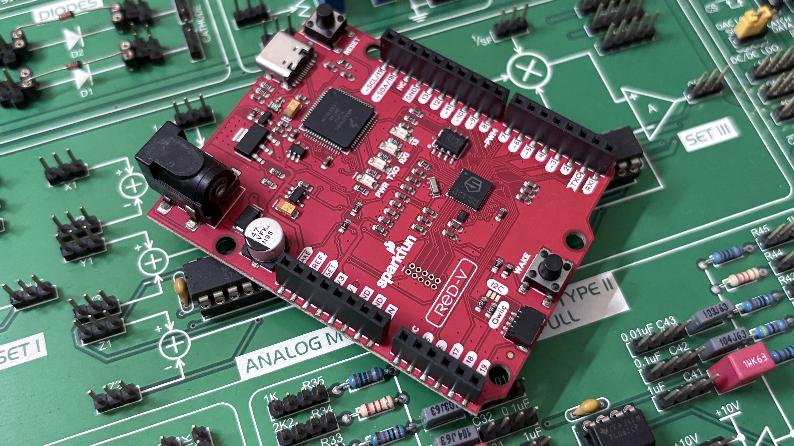

+++
title = '4 things to look for to master any Processor!'
date = "2023-04-21"

author = "Piyush Itankar"
authorImage ="teams/piyush.jpg"
preferred = "https://x.com/dstreetdogg"
linkedin = "https://www.linkedin.com/in/streetdogg/"
twitter = "https://x.com/dstreetdogg"
blog = "itankar.com"
email = "piyush@inpyjama.com"

tags = [
    "tips",
]
categories = [
    "tips",
]

series = ["tips"]
images = ["/post/mastering-processors/1.jpg"]
+++

Any time I have to work with a new CPU architecture, I look for the details on the four area discussed below.
<!--more-->

## Instruction Set Architecture

The Instruction Architecture of a processor defines the set of instructions that the processor can execute. In ARM CPUs, we use a Reduced Instruction Set Computing (RISC) architecture, which simplifies instruction decoding and allows for faster execution. The ARM instruction set includes operations such as arithmetic, logical, data movement, and control flow. Additionally, ARM CPUs support SIMD (Single Instruction Multiple Data) instructions, which allow for parallel processing of data.

To master the Instruction Architecture, it is important to understand
- the different types of instructions and their encoding.
- Understanding the instruction encoding is essential for implementing a decoder that can correctly interpret and execute the instructions.
- Additionally, it is essential to understand the interactions between instructions, such as how they affect the condition flags, to design efficient instruction pipelines.

Knowing this would enable you to understand how the processor moves the data around and operates on it.

## Exception Handling

Exception Handling is the mechanism by which a processor responds to events that can disrupt normal program execution. ARM CPUs support a range of exceptions, such as interrupts, traps, and faults. When an exception occurs, the processor transfers control to a specific exception handler routine.

To master Exception Handling, it is essential to understand the different types of exceptions and their causes. Typically the CPU, because it has to jump to a different code called the - Handler Routine or Interrupt Subroutine (ISR) has to save the CPU's current state.

> The CPU state in contained in the configuration and general purpose registers which is part of - The programmer's model of the CPU. Knowing how the CPU at the hardware state-machine level; enters and exits an interrupt handler enables one to design and write the event handling part of the firmware/code efficiently.

Typically there would also be a state diagram describing the various states that an interrupt can be, for example -
- Pending.
- Active.
- Active and Pending.
- Not-Active.

Knowing the relation between the transition and the relationship and preconditions makes life anxiety free during the debug.

## Memory Model

The Memory Model of a processor describes how memory is organized and accessed by the processor. Does the Processor pull of hidden tricks for performance gains? Like -

- Gathering outgoing transactions.
- Early acknowledge a transaction from the nearest bus boundary.
- Reorder memory requests.

Knowing what the CPU would consider as weak or strong memory is important. This greatly helps write the right software.

ARM A class CPUs use a virtual memory system that allows for the address space to be virtual. This feature provides several benefits such as improved security, better memory management, and simplified application development. One needs to be aware of understand how the memory related hardware works for a given CPU. Certain CPUs just protect the memory region based on physical addresses, few do so based on virtual addresses. There is a special dedicated hardware for both, Memory Protection Unity (MPU) on M-class and and Memory Management Unity (MMU) on A-Class, for example.

For the case of processors with an MMU, to master the Memory Model, it is essential to understand how the virtual memory system works, including the page tables, translation lookaside buffers, and memory protection mechanisms.

Additionally, it is essential to understand the interactions between the memory system and the instruction pipeline. For example, cache coherency and memory ordering are critical issues that must be addressed to ensure correct program execution.

## Debug Architecture

The Debug Architecture of a processor allows for debugging and analysis of program execution. ARM CPUs support a range of debug features, such as breakpoints, watch-points, and trace recording.

To master the Debug Architecture, it is essential to understand the different types of debug features and how they interact with the instruction pipeline. Additionally, it is essential to understand the different debug interfaces and protocols used for communication with external debuggers.

This understanding is crucial for designing a robust and efficient debug system that can help diagnose and correct program errors.

## Reference

My source of learning architecture has been ARM's documentation. Specifically the ones on the following links:
- [LEARN THE ARCHITECTURE A-Profile](https://www.arm.com/architecture/learn-the-architecture/a-profile?ref=inpyjama.com)
- [LEARN THE ARCHITECTURE M-Profile](https://www.arm.com/architecture/learn-the-architecture/m-profile?ref=inpyjama.com)
