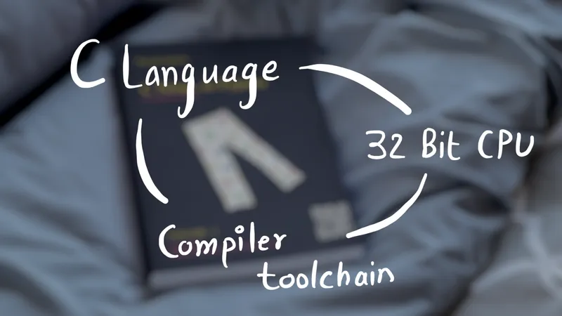
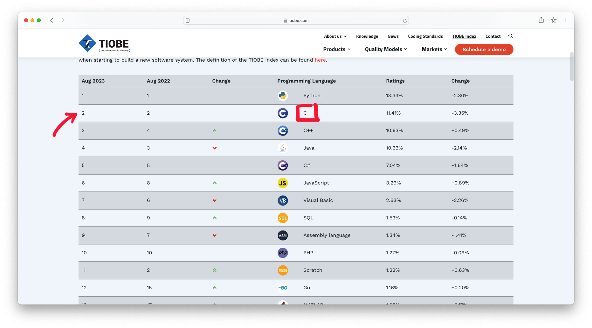
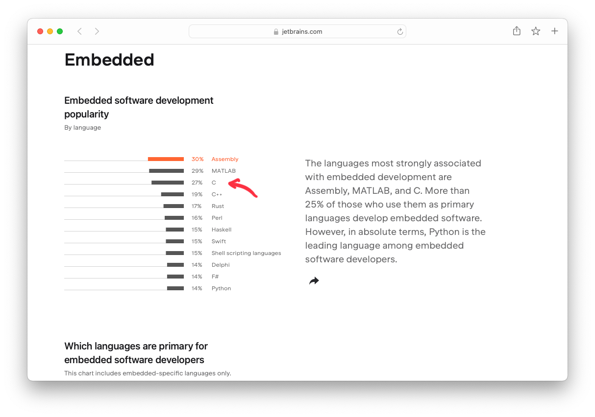
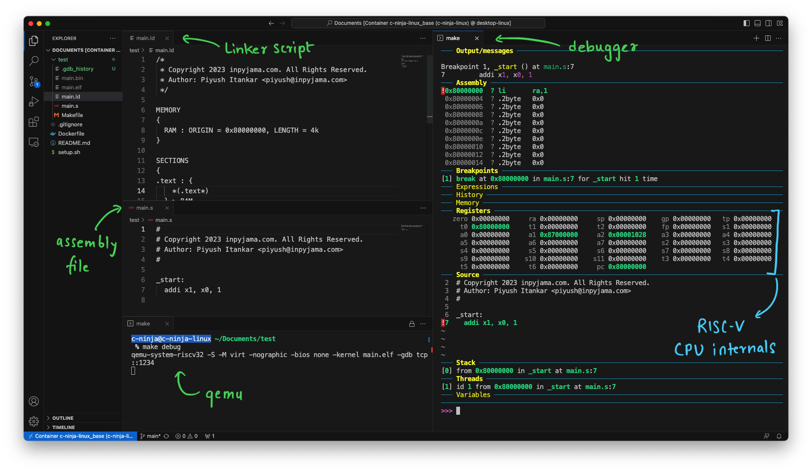
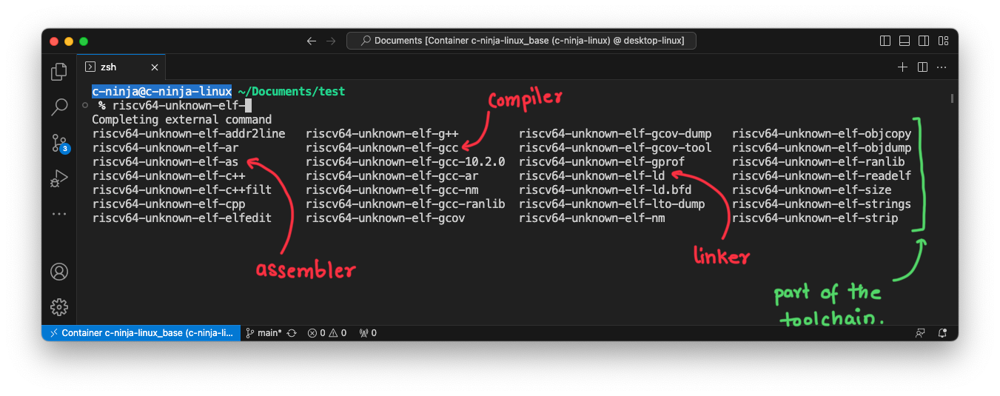

+++
date  = "2023-08-26"
title = '3 Must Have Skills to Ace Lower Level Software Engineering!'

author = "Piyush Itankar"
authorImage ="teams/piyush.jpg"
preferred = "https://x.com/dstreetdogg"
linkedin = "https://www.linkedin.com/in/streetdogg/"
twitter = "https://x.com/dstreetdogg"
blog = "itankar.com"
email = "piyush@inpyjama.com"

tags = [
    "Embedded", "Lower Level Software"
]

categories = [
    "Tips",
]

series = ["Tips"]
images = ["/post/must-have-skills/0.webp"]
+++

The three key skills you need to start your career as an embedded software engineer. Spoiler alert! It's `C-Language`, `32-bit CPUs`, and a good understanding of the `compiler toolchain`!

<!--more-->

I have been getting many messages on LinkedIn/Twitter specifically asking for guidance on how to get started or build skills to get started and excel in Embedded Systems. The question is loaded! I'll try my best to answer it in this post.

Embedded systems is an intersection of many fields and stretches from Electrical Engineering to Computer science for the most part, Plus based on what the application is, domain expertise may also be required.

If we skip the domain expertise, there are basics that can enable one to contribute and be useful on a team. One can then grow more with experience as one spends more time learning and doing experiments! In the early years of one's career, the focus should be on being coachable, trying to be useful, and growing into a dependable team member.

> Learn the vocabulary of the field so the seniors can talk to you and care to teach you.

## #1 - Learn C

Learn the C language. This language is not dead by any stretch of the imagination! Most processors in an embedded system are programmed in C, the Linux kernel is also written in C, CPython is written in C, lower-level standard libraries are written in C, and so on... C language represents the hardware really well and most engineers default to it as the language of choice.

> Few will argue that there are also C++ and Rust that are used in Embedded systems development. While that is true, over 99% of embedded systems solutions are based on C!

C has only 32 keywords, the rules are simple, and it represents the hardware really well. Learn to think in C!

For that, you should absolutely know the following concepts -
1. Pointers - to data and to executable code.
1. Typecasting pointers and variables.
1. Structures, unions, and bitfields.
1. The idea of objects - Structures with data and function pointers.
1. Laying out a given structure at a memory address.
1. volatile and const keywords.
1. Understand what each of 32 keywords means!

Most people learn C the wrong way! The right way to learn it is to first learn a CPU and program it in assembly and then ask - "Is there a way I can make programming easy?", The answer usually will be - C. Remember C was invented back when computer systems were very simple. C was created to make the assembly programs portable.

To get a feel for the syntax of the language you can of course try it on your local machine running an OS like Windows, Linux, or Mac and use the GCC compiler to compile and run the programs. Remember, however, that this is only to learn the syntax. To understand how the language works, you need to still try it out on a CPU directly.

> The `-S` option for GCC will generate the assembly code for you. Example:
>
> `$ gcc -S main.c`
>
> Will generate main.s file with assembly code directly generated from the C source in main.c.

You don't have to buy any hardware or a CPU just to learn the C language. There are emulators like [qemu](https://wiki.qemu.org/Main_Page?ref=ghost-blog.inpyjama.com) that emulate the CPUs on your OS, and the assembly and C code can be run on it directly. I plan on guiding you on how to do this in future posts.

> If you prefer exploring on your own, you might want to take a shot at the examples in this repo: https://github.com/google/esh/tree/main/examples/emulation

This brings us to the second thing you should know - a 32-bit CPU!

## #2 - 32-bit CPU, Preferably ARM or RISC-V
You can program an Arduino? Sorry, that doesn't count and isn't going to cut in! Any serious embedded engineer knows that they should know a 32-bit processor. How it works and how to boot it cold! You have to know or be interested in knowing the Instruction Set Architecture (ISA) of a 32-bit CPU. At the very least!

> Learning how a CPU works doesn't require you to know circuits and electronics. The Instruction Set Architecture (ISA) serves as an abstraction between the hardware designers and the software engineers. The software engineers only need to adhere to the abstraction...

I recommend focusing on either, RISC-V or ARM. RISC-V is my personal favorite because a lot of material is available online and the open-source community favors it. Learn the following -

1. Basic instructions from the ISA.
1. Writing an Assembly file and converting it to machine code using assembler.
1. How the CPU starts executing the first instruction.
1. How to write linker scripts and use a linker to place code at exactly the right location for the CPU to fetch.

> ARM or RISC-V?
>> Just pick anyone and start. It doesn't matter really, most embedded solutions will very likely have one of these. What you learn about one easily translates to the other.

When trying to master the CPU, focus on mastering these aspects of the CPU -

1. Programmer's model of the CPU.
1. Instruction Set Architecture (ISA).
1. Exception Model.
1. Memory Model.
1. Debug Model.

If you know these items about a CPU, you pretty much know what there is to know about the CPU from the embedded software engineering perspective. I plan on covering these for the RISC-V CPUs in future posts.

Trying to learn the CPU will only reinforce your C and assembly language abilities. You will soon learn to see the assembly code that your C code will decompose to! This is a very important skill to have and cannot be developed in a day. Again, when trying to learn the CPU, qemu will come in handy as a tool.

## #3 - Be able to use the Toolchain!

To develop software for RISC-V CPUs, you typically use an embedded software toolchain. An embedded software toolchain is a set of software development tools that aid in writing, compiling, and debugging software for embedded systems or specific processor architectures. The components of an embedded software toolchain for RISC-V CPUs include:

1. **Compiler:** The compiler translates high-level programming languages (like C or C++) into machine code that the RISC-V CPU can execute.
1. **Assembler:** The assembler converts assembly language code into machine code. Assembly language is a low-level human-readable representation of machine code instructions.
1. **Linker:** The linker takes the compiled machine code and combines it with necessary libraries and other object files to create an executable binary or program.
1. **Debugger:** The debugger is used for finding and fixing bugs in your code. It allows you to step through your code, inspect variables, and track the program's execution.

There are also many other utilities but the ones listed above are important ones and you should be comfortable using them and be at peace with the reason for their existence. The more of the toolchain utilities you know and can use, the more blissful life will be. You will be able to debug better, write better code, and understand how your code will be consumed by the toolchain to generate the final machine code.

We talked about the toolchain with respect to the RISC-V CPUs, but such a toolchain will be available for any processor that you have to work with. We will explore the various utilities in the toolchain in future posts.

## Why does this work well?

Being comfortable with the above three will enable exploring Operating systems and device driver programming which is what most embedded software engineers do. Experts will argue that this is not enough. And I would agree, but for someone to start their career and be a useful/productive member of the team these are more than enough. Anyone who can understand C, knows a little bit of CPU internals, and can use the toolchain effectively is a good hire and a productive teammate.

In my experience over the past decade ramping up and training more than a dozen freshers (many of whom had no prior experience with C, Electronics, or Computer architecture) and advising countless college students on Linkedin, I've realized that once someone is comfortable with these three, they gain enough confidence to thrive on their own and pretty soon learn to peel the Embedded systems develop Onion on their own.
