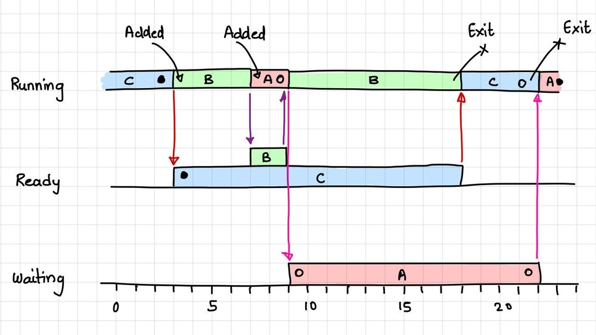
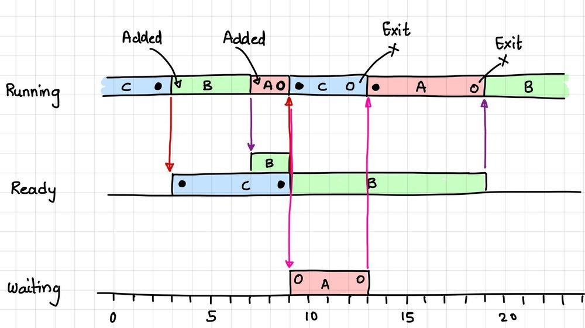

+++
title = "Mutex vs Semaphore"
date = "2023-04-20"

author = "Piyush Itankar"
authorImage ="teams/piyush.jpg"
preferred = "https://x.com/dstreetdogg"
linkedin = "https://www.linkedin.com/in/streetdogg/"
twitter = "https://x.com/dstreetdogg"
blog = "itankar.com"
email = "piyush@inpyjama.com"

tags = [
    "os"
]
categories = [
    "system", "c language"
]

series = ["OS"]
images = ["/post/mutex/1.jpg"]
+++

Very few people know this - A mutex is not same as a binary semaphore. It is very different in implementation and has a very different purpose and usage. We discuss the details in this post.
<!--more-->

Before we even begin, let us be on the same page with some terms and conventions to be used in the rest of the explanation.

1. `A` > `B` > `C` in terms of execution priority!
1. `Added` means the process was added to the queue.
1. `Exit` would mean the process terminated.
1. `A` and `C` share a resource.
1. In our case, `C` acquires the resource first and `A` waits for `C` to release it!
1. A `dark circle` represents a shared resource being acquired.
1. The `hollow circle` represents wanting to acquire the resource.
1. The scheduler is called every time a Process is added.

## Binary semaphore

Look at what happens when `A` is added (@ t=7) while `B` is executing. In the case of a semaphore being used between `A` and `C` - there is priority inversion!

`A` is a higher priority than `B` but, `B` gets to execute because `B` is a higher priority than `C`, and note that `C` has the resource that `A` depends on! So, `A` cannot be run anyway!

> When a lower priority process is scheduled over a higher priority process, it is called priority inversion.

Notice how B gets to run while A is waiting. This is problematic, especially in a real-time operating system. How can we prevent a higher priority process from being blocked by a lower priority process holding a required resource? One solution is to increase the priority of the process holding the resource.

## Mutex

If a mutex is used, the scheduler will be aware of the dependency between A and C, and prioritize C's execution. This minimizes priority inversion.

A `mutex` will inherit the process priority, and the scheduler can determine if a higher priority process is blocked by a resource acquired and held by a lower priority process. Note that in the figure above, as soon as process `A` tries to acquire the resource held by `C` (@ t=9), the scheduler lets `C` run and then immediately schedules `A` after `C` has released the resource (@ t=13).

> Notice the difference in the waiting time compared to Figure #1, where a semaphore is used.

# Mechanism: the key difference
There are many differences between semaphores and mutexes, but the biggest one is absolute - A mutex has a notion of inheriting the priority of the process, which minimizes priority inversion. Semaphores do not have this capability! Be aware that the ability of a mutex to inherit the priority of a process is usually a configurable parameter. One needs to specifically program it to behave as I described.

> **The Case of Mars rover...**
>>  The Mars rover would reset itself repeatedly, and it was discovered that this was due to priority inversion resulting from an unconfigured mutex priority inheritance parameter. Read more [here](https://www.cs.unc.edu/~anderson/teach/comp790/papers/mars_pathfinder_long_version.html?ref=ghost-blog.inpyjama.com).

On the usage
A mutex is usually considered for cases where access to a critical section/memory needs to be synchronized.

A and B both need to work on the same memory region. If A has the mutex for that shared memory, then B has to wait. Similarly, if B has the mutex, then A has to wait.

> A semaphore should only be used for signalling purposes.

Process A cannot proceed until B completes an action. A waits for a signal from B, and both A and B use a semaphore.

An example of this in an embedded systems context is when A needs to turn on an LED only after B signals that a button was pressed. A can then wait on a semaphore that B gives when B detects the button press.

# References
1. [Hands-On RTOS with Microcontrollers | Packt](https://www.packtpub.com/en-us/product/hands-on-rtos-with-microcontrollers-9781838826734)
1. [Difference between binary semaphore and mutex](https://stackoverflow.com/questions/62814/difference-between-binary-semaphore-and-mutex)
1. [Mutexes and Semaphores Demystified](https://barrgroup.com/blog/mutexes-and-semaphores-demystified)

---

`edit: 22 April, 2023`

[Parag Sangtani](https://www.linkedin.com/in/ACoAACnQh18BEcbIffPaf6qjG7BnLRWWBq75vs0) (one of the members of the community) provided the following links which suggests complete opposite of what I highlighted in this post above.

The fact that a binary semaphore can be used as a mutex in discussed in the links below -
- [Email conversation between kernel experts.](https://lkml.org/lkml/2005/12/15/304)
- [pthread documentation](https://pubs.opengroup.org/onlinepubs/7908799/xsh/pthread_mutexattr_setprotocol.html)
- [Linus's comment on mutex](https://lwn.net/Articles/178258/)
