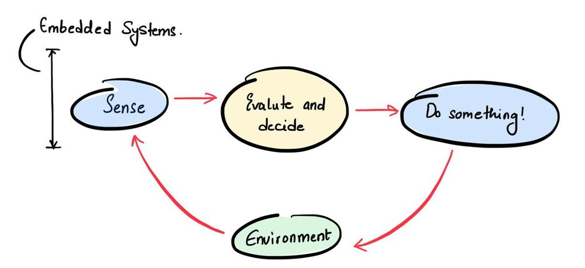
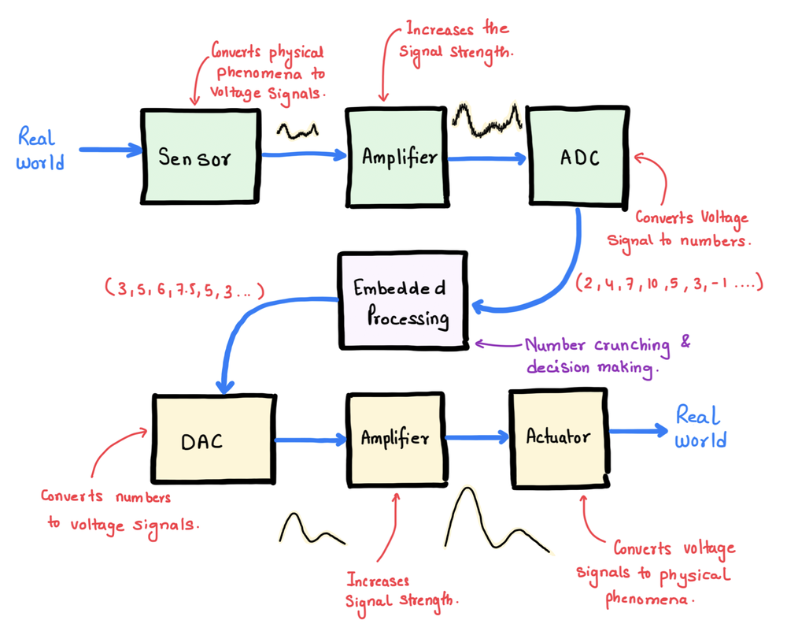
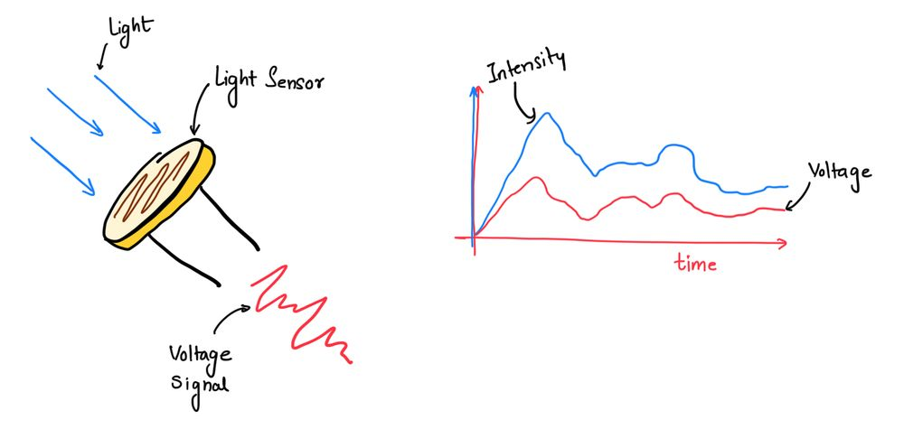
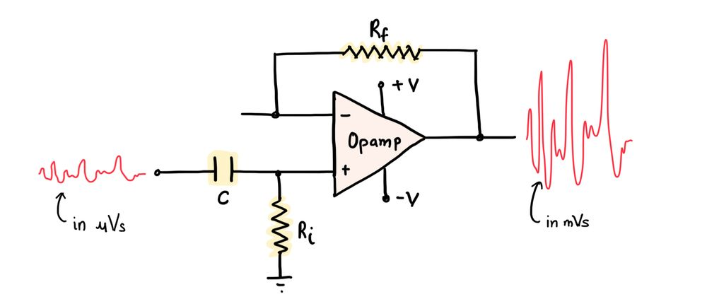
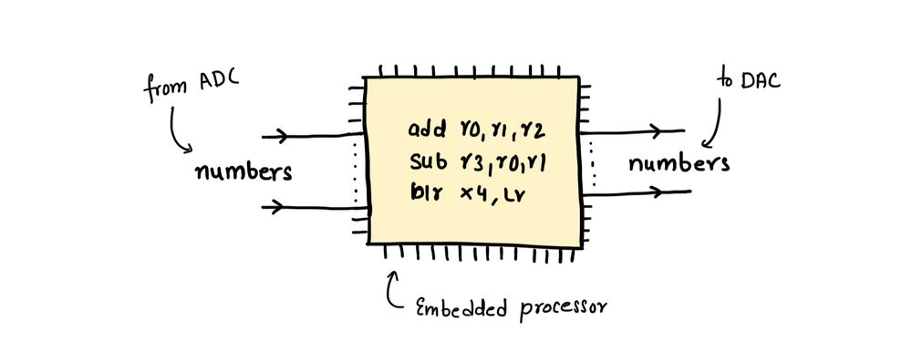
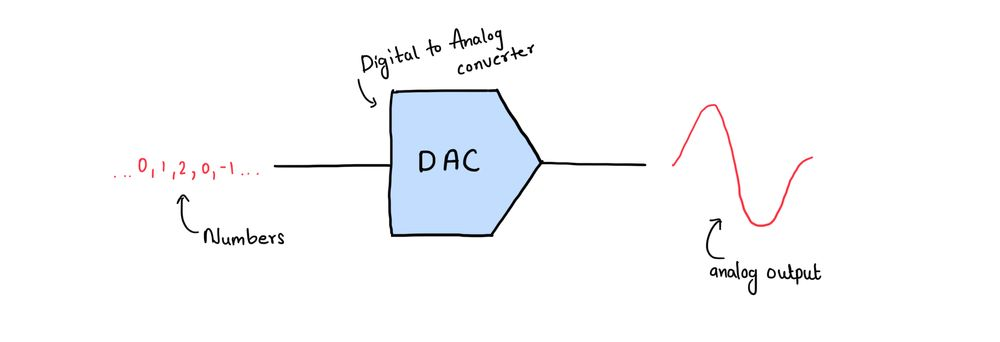
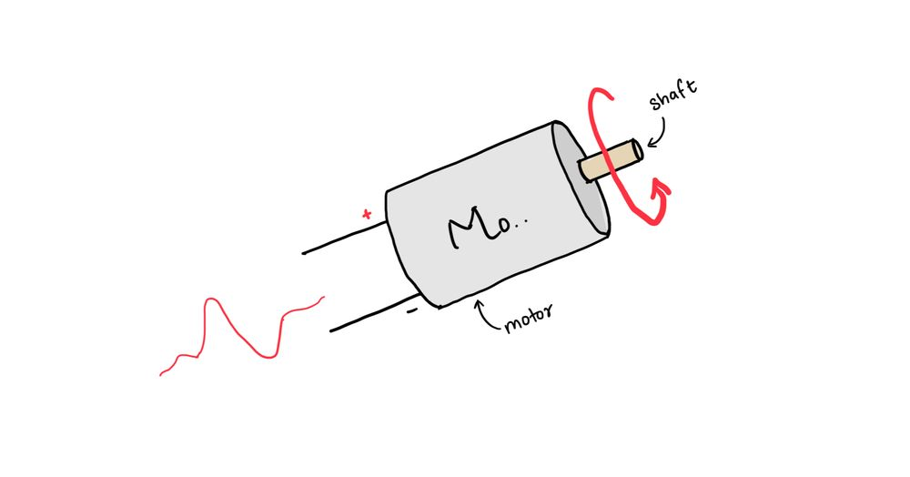

+++
title = 'What is an Embedded System?'
date = "2023-07-23"

author = "Piyush Itankar"
authorImage ="teams/piyush.jpg"
preferred = "https://x.com/dstreetdogg"
linkedin = "https://www.linkedin.com/in/streetdogg/"
twitter = "https://x.com/dstreetdogg"
blog = "itankar.com"
email = "piyush@inpyjama.com"

tags = [
    "tips",
]
categories = [
    "tips",
]

series = ["tips"]
images = ["/post/what-is-embedded-systems/1.jpg"]
+++

Embedded systems typically have a "sense the environment", "evaluate" and "do something to the environment" loop. The intention is to sense the environment and then influence it to get the desired effect.
<!--more-->

In the world of technology, embedded systems play a critical role in various applications, from consumer electronics and automotive systems to industrial automation and healthcare devices. An embedded system is a specialized computing system designed to perform specific tasks or functions within a larger system. These systems are embedded into other devices, making them integral parts of the overall system.

We will explore the fundamental components and processes that make up an embedded system by following the journey of a physical phenomenon through various stages to decision-making and finally, resulting in a desired action.

Embedded systems typically have a "sense the environment", "evaluate" and "do something to the environment" loop. The intention is to sense the environment and then influence it to get the desired effect. An example of something like this is - air conditioning. Sense the temperature, decide what to do, and get it done by compressing and decompressing the air!

## Sensor

> Converting physical phenomena to voltage signals!

At the heart of an embedded system, lies a sensor that detects and converts a physical phenomenon into an electrical voltage signal.

The physical phenomenon can be anything from temperature, pressure, light, motion, or any measurable quantity. For example, consider a light sensor that measures the ambient light and outputs an analog voltage proportional to the light intensity it detects.

## Amplifiers

> Strengthening the signals!

The raw voltage signal from the sensor may be weak and susceptible to noise during transmission. To ensure reliable and accurate data, the signal is passed through an amplifier circuit.

Amplifiers boost the strength of the signal while maintaining its integrity, thus making it less vulnerable to noise and interference. The strength of the signal is important for the next stages of the processing.

## ADC (Analog to Digital Converter)

> Sampling and Converting Signals to Numbers.

In most cases, modern embedded systems utilize digital processing, which requires data in digital format. The next step involves an Analog-to-Digital Converter (ADC) that samples the analog voltage signal and converts it into a series of digital numbers. Each number represents the value of the signal at a specific point in time.

The numbers output by the ADC are either saved in the memory and processed in periodic bursts by the processor or consumed as a stream of incoming numbers.

## Embedded Processing

> Number Crunching and Decision Making.

The series of digital numbers obtained from the ADC are now ready for processing. This is where the embedded processor, often a micro-controller or microprocessor, comes into play. The embedded processor performs calculations, executes algorithms, and makes decisions based on the received data. It can be programmed to perform a wide range of tasks, from simple control functions to complex data analysis.

### Series of Numbers

After the embedded processor has performed the necessary calculations and decision-making processes, it generates a series of output numbers that represent the results of its computations. These numbers carry the necessary information and instructions for the next stages of the system.

## DAC

> Converting Numbers to Continuous Voltage Signals.

The output of the embedded processor is typically in digital format, but some actuators require analog signals to produce physical actions. Here, the Digital-to-Analog Converter (DAC) comes into action.

The DAC takes the series of digital numbers and converts them back into continuous analog voltage signals.

## Amplifier (Again)

> Strengthening Signals for Actuation.

Similar to the amplifier used earlier in the process, this stage employs an amplifier to strengthen the analog voltage signals obtained from the DAC. Amplification ensures that the signals are of sufficient strength to drive the actuators effectively.

## Actuator

> Converting Continuous Voltage Signals to Physical Phenomena.

Finally, the amplified analog voltage signals are fed into the actuator. The actuator is a mechanical or electromechanical device that converts electrical signals into physical actions.

For instance, in an automotive application, the actuator could control the throttle or adjust the steering wheel angle based on the processed data from the embedded system.
